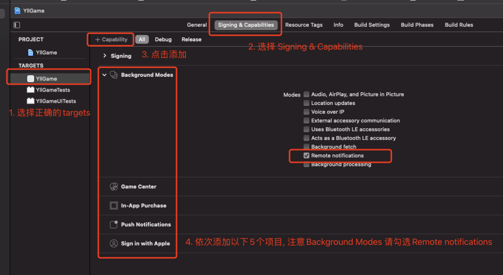
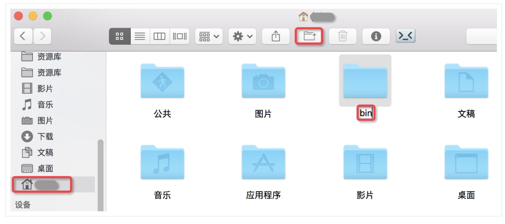
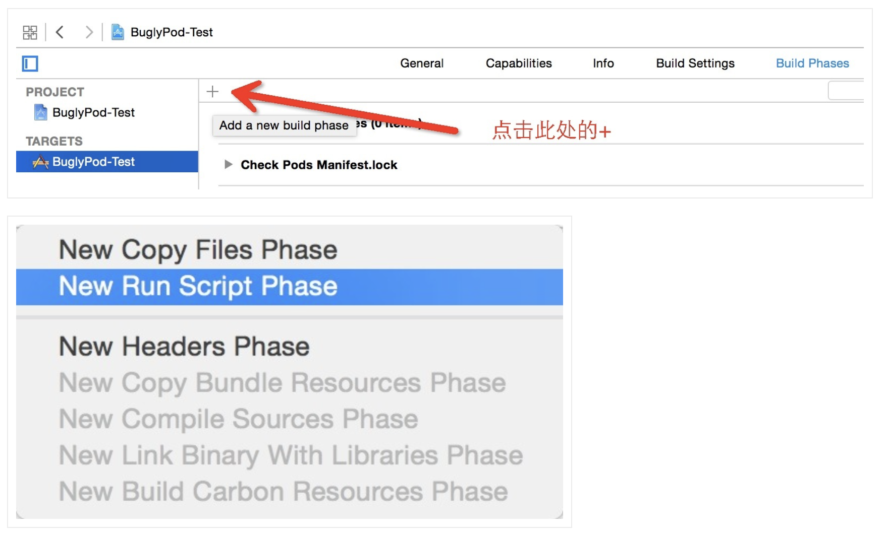
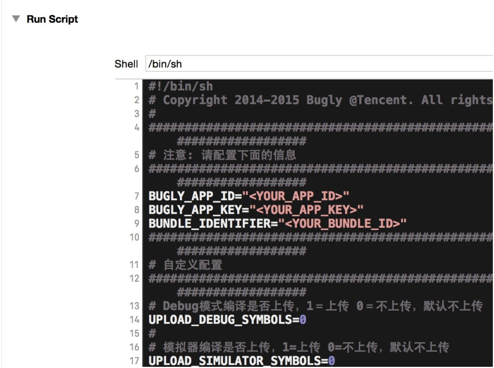

# iOS 接入文档

SDK下载地址(https://www.baidu.com)

## 1.接入前环境配置

**需要安装cocoapods管理工具([参考](https://www.kancloud.cn/god-is-coder/cocoapods/617031))**

**Xcode12.0+**

**SDK不支持bitcode，项目请勿打开**

## 2.iOS项目修改

### 2.1添加资源

- 将 iOS 目录下的 YllGameSDK.framework 文件夹拷贝到项目中正确目录下
- 右键项目，选择 Add File to "XXX"，选择刚才添加的framework，勾选 "Copy items if needed"，选择 "Create groups"，targets勾选mobile。

### 2.2配置项目

#### 1. cd 到 xxx.xcodeproj 目录下，pod init 创建pod管理文件

#### 2. 在podfile文件中添加以下依赖库
```obj-c
  pod 'FBSDKLoginKit', '~> 9.1.0'
  pod 'AppsFlyerFramework', '~> 6.2.5'
  pod 'Firebase/Analytics', '~> 6.34.0'
  pod 'Firebase/Messaging', '~> 6.34.0'
  pod 'Bugly', '~> 2.5.90'
```


去掉use_frameworks!前的#。</br>在工程的相对应的 `Targets` -> `Build Settings` 的 `Other Linker Flags` ，添加`$(inherited)`，然后执行 pod install。


#### 3. 配置Game Center、推送和内购配置
- 将`GoogleService-Info.plist`文件拖入项目。并配置以下选项



#### 4. Facebook 项目配置，使用包含应用数据的 XML 代码片段配置 Info.plist 文件([官网](https://developers.facebook.com/docs/facebook-login/ios/v2.2?locale=zh_CN))

1. 右键点击 Info.plist，然后选择 Open As（打开方式）▸ Source Code（源代码）。
2. 将下列 XML 代码片段复制并粘贴到文件正文中 (<dict>...</dict>)。
```xml
<key>CFBundleURLTypes</key>
<array>
    <dict>
        <key>CFBundleTypeRole</key>
        <string>Editor</string>
        <key>CFBundleURLSchemes</key>
        <array>
            <string>fb[APP_ID]</string>
        </array>
    </dict>
</array>

<key>FacebookAdvertiserIDCollectionEnabled</key>
<string>TRUE</string>
<key>FacebookAppID</key>
<string>[APP_ID]</string>
<key>FacebookAutoLogAppEventsEnabled</key>
<string>TRUE</string>
<key>FacebookDisplayName</key>
<string>[APP_NAME]</string>

<key>LSApplicationQueriesSchemes</key>
<array>
    <string>fbapi</string>
    <string>fbapi20130214</string>
    <string>fbapi20130410</string>
    <string>fbapi20130702</string>
    <string>fbapi20131010</string>
    <string>fbapi20131219</string>
    <string>fbapi20140410</string>
    <string>fbapi20140116</string>
    <string>fbapi20150313</string>
    <string>fbapi20150629</string>
    <string>fbapi20160328</string>
    <string>fbauth</string>
    <string>fb-messenger-share-api</string>
    <string>fbauth2</string>
    <string>fbshareextension</string>
</array>
```
3. 在 [CFBundleURLSchemes] 键内的 <array><string> 中，将 [APP_ID] 替换为应用编号。
4. 在 FacebookAppID 键内的 <string> 中，将 [APP_ID] 替换为应用编号。
5. 在 FacebookDisplayName 键内的 <string> 中，将 [APP_NAME] 替换为应用名称。
  
#### 5. Bugly符号表配置([官网](https://bugly.qq.com/docs/user-guide/symbol-configuration-ios/?v=20200622202242))
- SDK建议使用自动配置。
1. 自动配置请首先下载和解压[自动配置符号表工具包](https://bugly.qq.com/v2/sdk?id=6ecfd28d-d8ea-4446-a9c8-13aed4a94f04)，然后选择上传方式并配置Xcode的编译执行脚本。
2. 下载符号表提取工具依赖的[Java运行环境](http://www.oracle.com/technetwork/java/javase/downloads/jdk8-downloads-2133151.html)(JRE或JDK版本需要>=1.6)
3. 把工具包buglySymbollOS.jar 保存在用户主目录(Home)的bin目录下, (没有bin文件夹, 请自行创建):

4. 在Xcode工程对应的Target的Build Phases中新增Run Scrpit Phase

5. 打开工具包dSYM_upload.sh, 复制所有内容, 在新增的Run Scrpit Phase 中粘贴
6. 修改新增的Run Script中的<YOUR_APP_ID>为您的App ID, <YOUR_APP_KEY>为您的App key, <YOUR_BUNDLE_ID>为App的Bundle Id

7. 脚本默认的Debug模式及模拟器编译情况下不会上传符号表, 在需要上传的时候, 请修改下列选项</br>
Debug模式编译是否上传, 1 = 上传 0 = 不上传, 默认不上传</br>
UPLOAD_DEBUG_SYMBOLS=0</br>
模拟器编译是否上传. 1 = 上传 0 = 不上传, 默认不上传</br>
UPLOAD_SIMULATOR_SYMBOLS=0
- 至此，自动上传符号表脚本配置完毕，Bugly 会在每次 Xcode 工程编译后自动完成符号表配置工作。

#### 6. SDK需要获取 相册权限 和 IDFA权限, 即Privacy - Photo Library Usage Description 和 Privacy - Tracking Usage Description, 需要在info.plist添加, 具体描述请根据游戏的实际使用进行定义, 如果游戏没有使用, 可以向SDK方要通用的阿语描述。

## 3.SDK初始化与API接口

### 3.1 SDK初始化

- 在`AppDelegate.m`中添加头文件引用

```obj-c
#import <YllGameSDK/YllGameSDK.h>
```

- 在`AppDelegate.m`的`didFinishLaunchingWithOptions`方法中添加以下代码
```obj-c
//YllSDK-------Begin。gameAppId, appleAppId, appsFlyerDevKey这些参数需要联系游戏发行方获取，改为自己的！
[YllGameSDK getInstance].gameAppId = @"";
[YllGameSDK getInstance].appleAppId = @"";
[YllGameSDK getInstance].buglyAppId = @"";
[YllGameSDK getInstance].appsFlyerDevKey = @"";
// languageList 语言集合  游戏支持语言集合 现支持 ar 阿语 en 英语 该集合默认第一个是SDK的默认语言
[YllGameSDK getInstance].languageList = @[@"ar", @"en"];
// 当前设置的语言, 不传以 languageList 的第一个值为默认语言, 若 languageList 为 null, 默认为 ar
[YllGameSDK getInstance].localLanguage = @"ar";
    
// 设置完以上属性之后再调用该方法, 不然对于语区统计会有影响
[[YllGameSDK getInstance] yg_application:application didFinishLaunchingWithOptions:launchOptions];
// 初始化SDK
[[YllGameSDK getInstance] yg_init];
```

- 在`AppDelegate.m`中添加以下方法
```obj-c
- (BOOL)application:(UIApplication *)application openURL:(NSURL *)url options:(nonnull NSDictionary<UIApplicationOpenURLOptionsKey, id> *)options {
    return [[YllGameSDK getInstance] yg_application:application openURL:url options:options];
}

- (BOOL)application:(UIApplication *)application continueUserActivity:(NSUserActivity *)userActivity restorationHandler:(void (^)(NSArray<id<UIUserActivityRestoring>> * _Nullable))restorationHandler {
    return [[YllGameSDK getInstance] yg_application:application continueUserActivity:userActivity restorationHandler:restorationHandler];
}

- (void)application:(UIApplication *)application didReceiveRemoteNotification:(NSDictionary *)userInfo fetchCompletionHandler:(void (^)(UIBackgroundFetchResult))completionHandler {
    [[YllGameSDK getInstance] yg_application:application didReceiveRemoteNotification:userInfo fetchCompletionHandler:completionHandler];
}

- (void)application:(UIApplication *)application didRegisterForRemoteNotificationsWithDeviceToken:(NSData *)deviceToken {
    [[YllGameSDK getInstance] yg_application:application didRegisterForRemoteNotificationsWithDeviceToken:deviceToken];
}

- (void)applicationDidBecomeActive:(UIApplication *)application {
    [[YllGameSDK getInstance] yg_applicationDidBecomeActive:application];
}

- (void)applicationDidEnterBackground:(UIApplication *)application {
    [[YllGameSDK getInstance] yg_applicationDidEnterBackground:application];
}

- (void)applicationWillTerminate:(UIApplication *)application {
    [[YllGameSDK getInstance] yg_applicationWillTerminate:application];
}
```

### 3.2登陆与回调

- SDK为游戏方提供了两种登录获取账号信息方式, 即代理和闭包, 本文档的登录是用闭包, 如需使用代理, 请自行跳转到YllGameSDK.h文件进行查阅 
- 在项目中需要进行登录操作的xxx.h或xxx.m文件中导入 #import <YllGameSDK/YllGameSDK.h>

```obj-c
#import <YllGameSDK/YllGameSDK.h>
```

- 在`ViewController.m`文件中，实现对应的方法
```
[[YllGameSDK getInstance] yg_loginWithUserInfo:^(YGUserInfoModel * userInfoModel) {
    /** 
    请根据返回 userInfoModel 内 state 的不同枚举值进行实际业务场景处理
    当 userInfoModel.state == YGLoginSuccess || userInfoModel.state == YGChangeNickName 时, userInfoModel 里面的其他属性才有值
    typedef NS_ENUM(NSInteger, YGState) {
        YGTokenOverdue,   // token过期
        YGChangeNickName, // 修改昵称成功
        YGSwitchSuccess,  // 账号切换成功
        YGSwitchFailure,  // 账户切换失败
        YGLoginSuccess,   // 登录成功
        YGLoginFailure,   // 登录失败
        YGAccountBlock,   // 账号被封
        YGAccountRemote,  // 异地登录
        YGLogout,         // 退出登录
    };
    */
 }];
```
- 修改昵称成功(YGChangeNickName)是SDK账户体系的昵称修改，如果不使用，可以忽略。
- 退出登录(YGLogout)或者token过期(YGTokenOverdue)游戏方要退出到登陆界面并且清除本地用户信息，再调用登录函数。

### 3.2同步角色与回调
- 在游戏启动之后，需要调用此方法，否则会影响内购的补单操作。
- 在游戏使用中，函数中的任意参数发生变化，都需要调用该函数，进行数据同步。
```obj-c
/// 同步游戏角色(游戏登录之后必须调用)
/// @param roleId 游戏角色
/// @param roleName 角色名
/// @param roleLevel 角色等级
/// @param roleVipLevel 角色vip等级
/// @param serverId 所在游戏服
/// @param roleCastleLevel 城堡等级
/// @param completeHandle  error == nil  成功 (SDKV1.0.1 版本新增结果回调)
[[YllGameSDK getInstance] yg_synchroRoleWithRoleId:<#(nonnull NSString *)#> roleName:<#(nonnull NSString *)#> roleLevel:<#(NSInteger)#> roleVipLevel:<#(NSInteger)#> serverId:<#(NSInteger)#> roleCastleLevel:<#(NSInteger)#> completeHandle:^(NSError * _Nullable) {
     if (!error) {
     
     }
}];
```

### 3.3 充值与回调

- SDK对内购支付中出现的任何报错进行了弹窗提示，游戏方也可以从返回的失败回调内拿到具体的错误信息。

```obj-c
/// 商品充值
/// 创建支付清单
/// @param roleId 游戏角色Id
/// @param gameServerId 角色所在区服Id
/// @param cpno 订单号
/// @param cptime 订单生成时间
/// @param sku sku
/// @param amount amount
/// @param pointId 消费点Id
[[YllGameSDK getInstance] yg_createOrderWithRoleId:<#(nonnull NSString *)#> gameServerId:<#(NSInteger)#> cpno:<#(nonnull NSString *)#> cptime:<#(nonnull NSString *)#> sku:<#(nonnull NSString *)#> amount:<#(nonnull NSString *)#> pointId:<#(NSInteger)#> successBlock:^{
        <#code#>
    } failedBlock:^(YGPaymentFailedType type, NSString * _Nonnull errorDescription) {
        <#code#>
}];
```

### 3.4 打开登录页面

```obj-c
/// 展示登录页面
[[YllGameSDK getInstance] yg_showLoginView];
```

### 3.5 打开客服界面

```obj-c
/// 展示客服中心页面
/// @param roleId 游戏角色Id
/// @param gameServerId 角色所在区服Id
[[YllGameSDK getInstance] yg_showServiceChatViewWithRoleId:<#(nonnull NSString *)#> gameServerId:<#(NSInteger)#>];
```

### 3.6 打开SDK设置界面

```obj-c
/// 展示设置中心
/// @param roleId 游戏角色Id
/// @param gameServerId 角色所在区服Id
[[YllGameSDK getInstance] yg_showSettingsViewWithRoleId:<#(nonnull NSString *)#> gameServerId:<#(NSInteger)#>];
```

### 3.7 打开修改昵称界面

```obj-c
/// 展示昵称修改页面
[[YllGameSDK getInstance] yg_showNicknameView];
```

### 3.8 打开用户管理界面

```obj-c
/// 展示账户管理
[[YllGameSDK getInstance] yg_showAccountManagementView];
```

### 3.9 检查账号绑定

```obj-c
/// 检查游客账号是否绑定第三方账号, true == 绑定, false == 未绑定
- (BOOL)yg_checkBindState;
```

### 3.10 设置SDK语言

```obj-c
// languageList 语言集合  游戏支持语言集合 现支持 ar 阿语 en 英语 该集合默认第一个是SDK的默认语言
[YllGameSDK getInstance].languageList = @[@"ar", @"en"];
// 当前设置的语言, 不传以 languageList 的第一个值为默认语言, 若 languageList 为 null, 默认为 ar
[YllGameSDK getInstance].localLanguage = @"ar";
```

### 3.11 自定义埋点

evName和params参照[YllSDK IOS埋点](https://github.com/yllgame2021/yllgamesdk/blob/master/%E5%9F%8B%E7%82%B9%E9%9C%80%E6%B1%82/IOS/%E7%BB%9F%E8%AE%A1%E5%9F%8B%E7%82%B9IOS.md)

### 3.12 获取推送token

```obj-c
[[YllGameSDK getInstance] yg_getPushToken:<#^(NSString * _Nullable, NSError * _Nullable)pushToken#>];
```

### 3.13 推送处理

- 推送分为SDK推送和游戏方推送，区分两者的方法在于主要在于返回的消息字典(userInfo)内是否含有 YllGameSDKMsgId 这个key，包含该key表明是SDK推送，游戏方可不用处理该条推送.

1. App冷启动, 在此方法处理推送
```obj-c
- (BOOL)application:(UIApplication *)application didFinishLaunchingWithOptions:(NSDictionary *)launchOptions {
    if (launchOptions && [launchOptions.allKeys containsObject:UIApplicationLaunchOptionsRemoteNotificationKey]) {
         NSDictionary *userInfo = launchOptions[UIApplicationLaunchOptionsRemoteNotificationKey];
    }
}
```
2. App在前台或后台, 收到通知在此方法处理推送
```obj-c
- (void)application:(UIApplication *)application didReceiveRemoteNotification:(NSDictionary *)userInfo fetchCompletionHandler:(void (^)(UIBackgroundFetchResult))completionHandler { }
```

### 3.14 获取SDK版本

```obj-c
// 调用该方法, 在控制台显示当前SDK的版本信息
NSString *SDKVersion = [[YllGameSDK getInstance] yg_getSDKVersion];
```

### 3.15 获取SDKBuild

```obj-c
// 调用该方法, 在控制台显示当前SDK的版本信息
NSString *SDKBuild = [[YllGameSDK getInstance] yg_getSDKBuild];
```

### 3.16 检查SDK版本(非必要)
- 此方法只是在控制台打印当前SDK的版本和最新的SDK版本

```obj-c
// 调用该方法, 在控制台显示当前SDK的版本信息
[[YllGameSDK getInstance] yg_checkSDKVersion];
```

