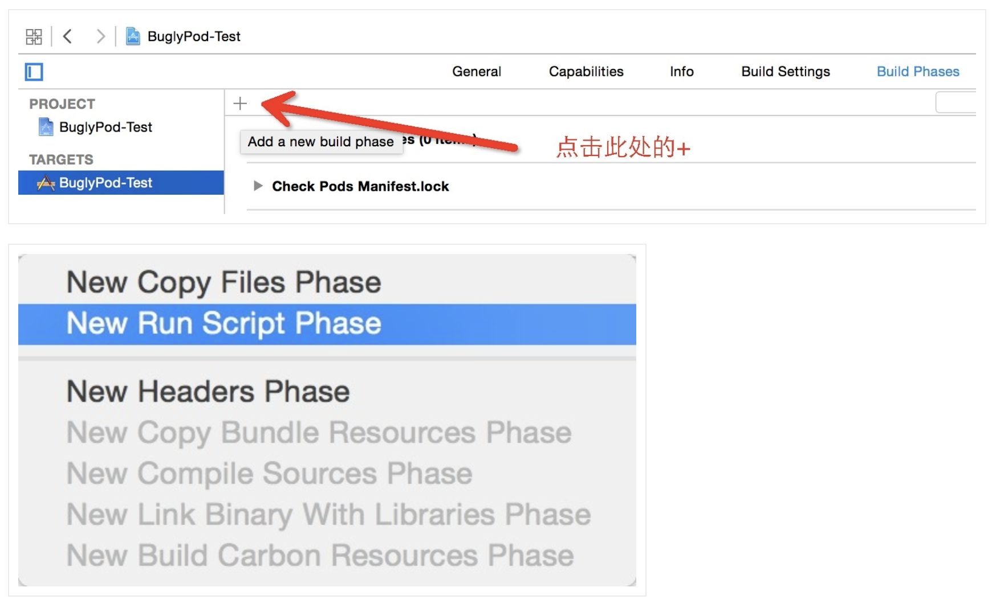

# Cocos2d-x（IOS）接入文档

SDK下载地址(https://www.baidu.com)

## 1.接入前环境配置

**需要安装pod管理工具**
- Xcode 12.0 +
- Cocos2d-x 3.17
- ios 9.0 +

## 2.IOS项目修改

### 2.1添加资源

- 将 IOS 目录下的 `YllGameSDK.framework` 文件夹和`YllGameResource.bundle`拷贝到项目的 `proj.ios_mac/ios`目录下
- 右键`项目/ios`，选择 Add File to "XXX" , 选择刚才添加的framework和bundle，勾选 "Copy items if needed"，选择 "Create groups"，targets勾选mobile。
- 导入 `YllGameHelper.lua` 文件到工程里，并在调用方法的时候引用，例如：

``` lua
  local YllGameHelper = require("app.models.YllGameHelper")
  --require里面是YllGameHelper.lua所在目录
```

### 2.2配置项目

1. cd到proj.ios_mac目录下，pod init 创建pod管理文件
2. 在podfile文件中,mobile中添加以下依赖库

```pod
pod 'FBSDKLoginKit', '~> 9.1.0'
pod 'AppsFlyerFramework', '~> 6.2.5'
pod 'Firebase/Analytics', '~> 6.34.0'
pod 'Firebase/Messaging', '~> 6.34.0'
pod 'Bugly', '~> 2.5.90'
```

3. 取消 `platform :ios, '9.0'`注释,并更改项目`targets->build Setting-> IOS Deployment Target`为 `ios 9.0`

4. 取消 `use_frameworks` 前面的注释，然后执行 pod update

5. 关闭项目，重新打开 `project.xcworkspace`

6. 打开项目`Target`-->`building settings`中搜索`Header Search Paths`和`Other Linker Flags` ，添加`$(inherited)`。

7. 配置登陆和推送
- 添加以下几种登陆方式(苹果账号登陆&GameCenter登陆)


- 配置以下选项后，将`GoogleService-Info.plist`文件拖入项目。


8. 右键`ios/info.list`，选择`open AS`->`Scoure Code`，在dict中添加以为值  

**注意**
- 需要将 `CFBundleURLSchemes` 值替换为"fb"+申请的Facebook Appid(fb157932462436275)
- 需要将 `FacebookAppID`值替换为申请的Facebook Appid(157932462436275)
- 需要将在 `FacebookDisplayName` 值修改为应用名称。
- `NSPhotoLibraryUsageDescription` 为调用相册权限的描述，可以自行修改
- `NSUserTrackingUsageDescription` 为IDFA权限的描述，可以自行修改

```xml
<key>CFBundleURLTypes</key>
<array>
    <dict>
        <key>CFBundleTypeRole</key>
        <string>Editor</string>
        <key>CFBundleURLSchemes</key>
        <array>
            <string>fb157932462436275</string>
        </array>
    </dict>
</array>

<key>FacebookAdvertiserIDCollectionEnabled</key>
<string>TRUE</string>
<key>FacebookAppID</key>
<string>157932462436275</string>
<key>FacebookAutoLogAppEventsEnabled</key>
<string>TRUE</string>
<key>FacebookDisplayName</key>
<string>YllGameDemo</string>

<key>LSApplicationQueriesSchemes</key>
<array>
    <string>fbapi</string>
    <string>fbapi20130214</string>
    <string>fbapi20130410</string>
    <string>fbapi20130702</string>
    <string>fbapi20131010</string>
    <string>fbapi20131219</string>
    <string>fbapi20140410</string>
    <string>fbapi20140116</string>
    <string>fbapi20150313</string>
    <string>fbapi20150629</string>
    <string>fbapi20160328</string>
    <string>fbauth</string>
    <string>fb-messenger-share-api</string>
    <string>fbauth2</string>
    <string>fbshareextension</string>
</array>
<key>NSPhotoLibraryUsageDescription</key>
<string>Photos will be used in Personal info, Discovery, Message and Album.</string>
<key>NSUserTrackingUsageDescription</key>
<string>سيتم استخدام بياناتك لتزويدك بخدمة أفضل وتجربة إعلانية مخصصة</string>
```

### 2.3 **新增Bugly配置**

Bugly符号表配置([官网](https://bugly.qq.com/docs/user-guide/symbol-configuration-ios/?v=20200622202242))
- SDK建议使用自动配置。
1. 自动配置请首先下载和解压[自动配置符号表工具包](https://bugly.qq.com/v2/sdk?id=6ecfd28d-d8ea-4446-a9c8-13aed4a94f04)，然后选择上传方式并配置Xcode的编译执行脚本。
2. 下载符号表提取工具依赖的[Java运行环境](http://www.oracle.com/technetwork/java/javase/downloads/jdk8-downloads-2133151.html)(JRE或JDK版本需要>=1.6)
3. 把工具包buglySymbollOS.jar 保存在用户主目录(Home)的bin目录下, (没有bin文件夹, 请自行创建):

4. 在Xcode工程对应的Target的Build Phases中新增Run Scrpit Phase

5. 打开工具包dSYM_upload.sh, 复制所有内容, 在新增的Run Scrpit Phase 中粘贴
6. 修改新增的Run Script中的<YOUR_APP_ID>为您的App ID, <YOUR_APP_KEY>为您的App key, <YOUR_BUNDLE_ID>为App的Bundle Id

7. 脚本默认的Debug模式及模拟器编译情况下不会上传符号表, 在需要上传的时候, 请修改下列选项</br>
Debug模式编译是否上传, 1 = 上传 0 = 不上传, 默认不上传</br>
UPLOAD_DEBUG_SYMBOLS=0</br>
模拟器编译是否上传. 1 = 上传 0 = 不上传, 默认不上传</br>
UPLOAD_SIMULATOR_SYMBOLS=0
- 至此，自动上传符号表脚本配置完毕，Bugly 会在每次 Xcode 工程编译后自动完成符号表配置工作。

## 3.SDK初始化与API接口

### 3.1 SDK初始化

- 在`AppController.mm`中添加头文件引用

```obj-c
#import <YllGameSDK/YllGameSDK.h>
```

- 在`AppController.mm`的`didFinishLaunchingWithOptions`方法中添加以下代码
```obj-c
//YllSDK-------Begin。appid，key这些参数需要联系游戏发行方获取，改为自己的！
[YllGameSDK getInstance].gameAppId = @"202012031818";
[YllGameSDK getInstance].appleAppId = @"1547226212";
[YllGameSDK getInstance].appsFlyerDevKey = @"SXxcrcc7oqnPXV9ycDerVP";

//设置Bugly AppID，初始化会在yg_init内部调用
[YllGameSDK getInstance].buglyAppId = @"";

// languageList 语言集合  游戏支持语言集合 现支持 ar 阿语 en 英语 该集合默认第一个是SDK的默认语言
[YllGameSDK getInstance].languageList = @[@"ar", @"en"];

// 当前设置的语言, 不传以 languageList 的第一个值为默认语言, 若 languageList 为 null, 默认为 ar
[YllGameSDK getInstance].localLanguage = @"en";

// 设置完以上属性之后再调用该方法, 不然对于语区统计会有影响
[[YllGameSDK getInstance] yg_application:application didFinishLaunchingWithOptions:launchOptions];

// 初始化SDK
[[YllGameSDK getInstance] yg_init];
//YllSDK------end
```

- 在`AppController.mm`中添加以下方法
```obj-c
//YllSDK-----fun Begin-------
- (BOOL)application:(UIApplication *)application openURL:(NSURL *)url options:(nonnull NSDictionary<UIApplicationOpenURLOptionsKey, id> *)options {
    return [[YllGameSDK getInstance] yg_application:application openURL:url options:options];
}
- (BOOL)application:(UIApplication *)application continueUserActivity:(NSUserActivity *)userActivity restorationHandler:(void (^)(NSArray<id<UIUserActivityRestoring>> * _Nullable))restorationHandler {
    return [[YllGameSDK getInstance] yg_application:application continueUserActivity:userActivity restorationHandler:restorationHandler];
}

- (void)application:(UIApplication *)application didReceiveRemoteNotification:(NSDictionary *)userInfo fetchCompletionHandler:(void (^)(UIBackgroundFetchResult))completionHandler {
    [[YllGameSDK getInstance] yg_application:application didReceiveRemoteNotification:userInfo fetchCompletionHandler:completionHandler];
}
- (void)application:(UIApplication *)application didRegisterForRemoteNotificationsWithDeviceToken:(NSData *)deviceToken {
    [[YllGameSDK getInstance] yg_application:application didRegisterForRemoteNotificationsWithDeviceToken:deviceToken];
}
// YllSDK---------func End
```

### 3.2登陆与回调
- 在`RootViewController.h`文件中，添加头文件引用，并定义回调

```obj-c
#import <YllGameSDK/YllGameSDK.h>
@property(nonatomic,assign) int loginCallBack; //登陆回调
@property(nonatomic,assign) int modifyNameCallBack;//修改昵称回调
@property(nonatomic,assign) int syncRoleCallBack; //同步角色回调
@property(nonatomic,assign) int payCallBack;//支付回调
```

- 在`RootViewController.mm`文件中，实现对应的方法
```obj-c
//实现登陆以及回调，loginCode状态为以下枚举，根据需要做自己的处理
//typedef NS_ENUM(NSInteger, YGState) {
//    YGTokenOverdue, // token过期, 重新登录
//    YGChangeNickName, // 修改昵称成功
//    YGSwitchSuccess, // 账号切换成功
//    YGSwitchFailure, // 账户切换失败
//    YGLoginSuccess, // 登录成功
//    YGLoginFailure, // 登录失败
//    YGAccountBlock, // 账号被封
//    YGAccountRemote, // 异地登录
//    YGLogout, // 退出登录
//};

//登陆
+(void) login:(NSDictionary *)dic{
    [[RootViewController getInstance] loginCall:dic];
}
-(void) loginCall:(NSDictionary *)dic{
    self.loginCallBack = [[dic objectForKey:@"luaFun"] intValue];
    [YllGameSDK getInstance].delegate = self;
    [[YllGameSDK getInstance] yg_login];
}
//登陆回调
- (void)yg_getUserInfo:(YGUserInfoModel *)userInfoModel {
    NSDictionary *info=@{@"accessToken":userInfoModel.accessToken ,
                         @"nickName":userInfoModel.nickname,
                         @"openUserId":userInfoModel.userOpenId,
                         @"loginCode":[NSString stringWithFormat:@"%d",(int)userInfoModel.state]};
    NSError *error = nil;
    NSData *jsonData = [NSJSONSerialization dataWithJSONObject:info
                                                          options:NSJSONWritingPrettyPrinted
                                                            error:&error];
    NSString *jsonString = [[NSString alloc] initWithData:jsonData
    encoding:NSUTF8StringEncoding];

    //将需要传递给 Lua function 的参数放入 Lua stack
    cocos2d::LuaObjcBridge::pushLuaFunctionById(self.loginCallBack);
    cocos2d::LuaObjcBridge::getStack()->pushString([jsonString UTF8String]);//返回json字串
    cocos2d::LuaObjcBridge::getStack()->executeFunction(1);//1个参数
//    cocos2d::LuaObjcBridge::releaseLuaFunctionById(self.loginCallBack);//释放
}
```

**返回登陆失败和Token失效建议游戏内再调一次登陆Api重试**

**退出登录要退出到登陆界面并且清除本地用户信息!**

### 3.2同步角色与回调

```obj-c
//同步角色
+(void) syncRoleInfo:(NSDictionary *)dic{
    [[RootViewController getInstance] syncRoleInfoCall:dic];
}
-(void) syncRoleInfoCall:(NSDictionary *)dic{
    NSString *roleid = [dic objectForKey:@"rid"];
    NSInteger serverId = [[dic objectForKey:@"sid"] integerValue];
    self.syncRoleCallBack = [[dic objectForKey:@"luaFun"] intValue];
    [[YllGameSDK getInstance] yg_synchroRoleWithRoleId:roleid roleName:@"5" roleLevel:5 roleVipLevel:5 serverId:serverId roleCastleLevel:999 completeHandle:^(NSError * _Nonnull error) {
        if (!error) {
            //同步角色回调
            //将需要传递给 Lua function 的参数放入 Lua stack
            cocos2d::LuaObjcBridge::pushLuaFunctionById(self.syncRoleCallBack);
            cocos2d::LuaObjcBridge::getStack()->pushString("success");//返回同步成功
            cocos2d::LuaObjcBridge::getStack()->executeFunction(1);//1个参数
            //cocos2d::LuaObjcBridge::releaseLuaFunctionById(self.syncRoleCallBack);//释放
        }
    }];
}
```

### 3.3 充值与回调

```obj-c
//商品充值
+(void) pay:(NSDictionary *)dic{
    [[RootViewController getInstance] payCall:dic];
}
-(void) payCall:(NSDictionary *)dic{
    NSString *roleid = [dic objectForKey:@"rid"];
    NSInteger serverId = [[dic objectForKey:@"sid"] integerValue];
    NSString *sku = [dic objectForKey:@"sku"];
    NSString *price = [dic objectForKey:@"pri"];
    double pointID = [[dic objectForKey:@"pid"] integerValue];
    self.payCallBack = [[dic objectForKey:@"luaFun"] intValue];
    //其他参数
    NSDate* date = [NSDate dateWithTimeIntervalSinceNow:0];
    NSTimeInterval time=[date timeIntervalSince1970]*1000;
    NSString *timeString = [NSString stringWithFormat:@"%.0f", time];
    // 创建订单
    [[YllGameSDK getInstance] yg_createOrderWithRoleId:roleid gameServerId:serverId cpno:timeString cptime:timeString sku:sku amount:price pointId:pointID successBlock:^{
        cocos2d::LuaObjcBridge::pushLuaFunctionById(self.payCallBack);
        cocos2d::LuaObjcBridge::getStack()->pushString([[NSString stringWithFormat:@"%.2f", pointID] UTF8String]);//返回同步成功
        cocos2d::LuaObjcBridge::getStack()->executeFunction(1);//1个参数
//        cocos2d::LuaObjcBridge::releaseLuaFunctionById(self.payCallBack);//释放
    } failedBlock:^(YGPaymentFailedType type, NSString * _Nonnull errorDescription) {
        
    }];
}
```

### 3.4 打开客服界面

```obj-c
//客服
+(void) showserviceChat:(NSDictionary *)dic{
    double   rsid = [[dic objectForKey:@"rsid"] doubleValue];
    NSString *rid = [dic objectForKey:@"rid"];
    [[YllGameSDK getInstance] yg_showServiceChatViewWithRoleId:rid gameServerId:rsid];
}
```

### 3.5 打开SDK设置界面

```obj-c
//设置界面
+(void) showSetting:(NSDictionary *)dic{
    NSString *roleid = [dic objectForKey:@"rid"];
    double serverId = [[dic objectForKey:@"sid"] integerValue];
    [[YllGameSDK getInstance] yg_showSettingsViewWithRoleId:roleid gameServerId:serverId];
}
```

### 3.6打开修改昵称界面

```obj-c
+(void) showModifyName:(NSDictionary *)dic{
    [[YllGameSDK getInstance] yg_showNicknameView];
}
```

### 3.7打开用户管理界面

```obj-c
//账号管理界面
+(void) showAccountManage:(NSDictionary *)dic{
    [[YllGameSDK getInstance] yg_showAccountManagementView];
}
```

### 3.8检查账号绑定

```obj-c
//检查账号绑定
+(void) checkBind:(NSDictionary *)dic{
    [[YllGameSDK getInstance] yg_checkBindState];
}
```

### 3.9设置SDK语言

```obj-c
//设置语言
+(void) setLanguage:(NSDictionary *)dic{
    NSString *lan = [dic objectForKey:@"lan"];
    [YllGameSDK getInstance].localLanguage = lan;
}
```

### 3.10检查SDK版本(非必要)
```obj-c
+(void) checkSDKInfo:(NSDictionary *)dic{
    [[YllGameSDK getInstance] yg_checkSDKVersion];
}
```

### 3.11获取SDK版本信息(非必要)
```obj-c
//获取SDK版本
+(NSString*) getSDKInfo:(NSDictionary *)dic{
    NSString *SDKBuild = [[YllGameSDK getInstance] yg_getSDKBuild];
    return SDKBuild;
}
```

yg_getSDKBuild
### 3.12自定义埋点
evName和params参照[YllSDK IOS埋点](https://github.com/yllgame2021/yllgamesdk/blob/master/%E5%9F%8B%E7%82%B9%E9%9C%80%E6%B1%82/IOS/%E7%BB%9F%E8%AE%A1%E5%9F%8B%E7%82%B9IOS.md)
```obj-c
+(void) onEvent:(NSDictionary *)dic{
    NSString *evName = [dic objectForKey:@"evName"];
    NSString * jsStr = [dic objectForKey:@"jsStr"];
    NSDictionary *dicstr = [[RootViewController getInstance] dictForJSONString:jsStr];
    [[YGEventManager getInstance] onEvent:evName params:dicstr];
}
- (NSDictionary *)dictForJSONString:(NSString *)str
{
    NSData *jsonData = [str dataUsingEncoding:NSUTF8StringEncoding];
    NSError *err;
    NSDictionary *dic = [NSJSONSerialization JSONObjectWithData:jsonData
                                                        options:NSJSONReadingMutableContainers
                                                          error:nil];
    return dic;
}
```

## 4.消息推送
推送分为SDK推送和游戏方推送，区分两者的方法在于主要在于返回的消息字典(userInfo)内是否含有 YllGameSDKMsgId 这个key，包含该key表明是SDK推送，游戏方可不用处理该条推送.
### 4.1 获取推送token
```obj-c
[[YllGameSDK getInstance] yg_getPushToken:<#^(NSString * _Nullable, NSError * _Nullable)pushToken#>];
```

### 4.2. App冷启动, 在此方法处理推送
在`didFinishLaunchingWithOptions`方法添加以下代码
```obj-c
- (BOOL)application:(UIApplication *)application didFinishLaunchingWithOptions:(NSDictionary *)launchOptions {
    ****************
    if (launchOptions && [launchOptions.allKeys containsObject:UIApplicationLaunchOptionsRemoteNotificationKey]) {
         NSDictionary *userInfo = launchOptions[UIApplicationLaunchOptionsRemoteNotificationKey];
    }
    ***************
}
```
### 4.3 App在前台或后台, 收到通知在此方法处理推送
```obj-c
- (void)application:(UIApplication *)application didReceiveRemoteNotification:(NSDictionary *)userInfo fetchCompletionHandler:(void (^)(UIBackgroundFetchResult))completionHandler { 
    [[YllGameSDK getInstance] yg_application:application didReceiveRemoteNotification:userInfo fetchCompletionHandler:completionHandler];
}
```
